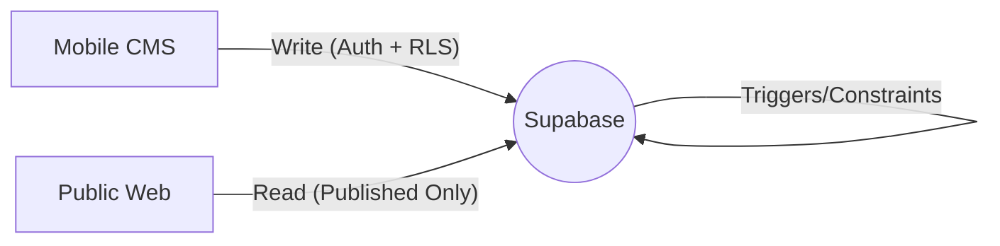

# Solo-Leveling Portfolio Architecture

## System Overview
The Solo-Leveling Portfolio is a headless portfolio system built for high performance, security, and ease of management.

### Components
1. **CMS (Expo Mobile App)**:
   - Used by the owner to manage content on the go.
   - Communicates with Supabase using the `ANON_KEY` to enforce Row Level Security (RLS).
   - Implements strict input validation using **Zod**.

2. **Public Website (Next.js)**:
   - High-performance, SEO-optimized portfolio display.
   - Uses Server-Side Rendering (SSR) for data fetching.
   - Optimized queries with specific column selection and "published-only" filtering.

3. **Backend (Supabase/PostgreSQL)**:
   - Database, Authentication, and File Storage.
   - **RLS Enforced**: Only the owner (authenticated) can write; public can only read published records.
   - **Automated Triggers**: PostgreSQL triggers handle `updated_at` timestamps.
   - **Soft Deletes**: Records are archived using `archived_at` instead of hard deletes.

## Data Flow


## Security Model
- **Ownership**: Every record has a `user_id` linked to the auth system.
- **RLS Policies**:
  - `SELECT`: Allowed for public if `is_published = true` and `archived_at IS NULL`.
  - `ALL`: Allowed only if `auth.uid() = user_id`.
- **Validation**: Zod schemas in the CMS act as a first line of defense before data hits the DB.

## Reliability Features
- **Fail-Safe Loading**: Next.js loading states provide immediate feedback.
- **Mock Data Fallback**: Both CMS and Web fall back to mock data if the database is unreachable or empty.
- **Env Validation**: Runtime checks for critical API keys avoid silent failures.
```
